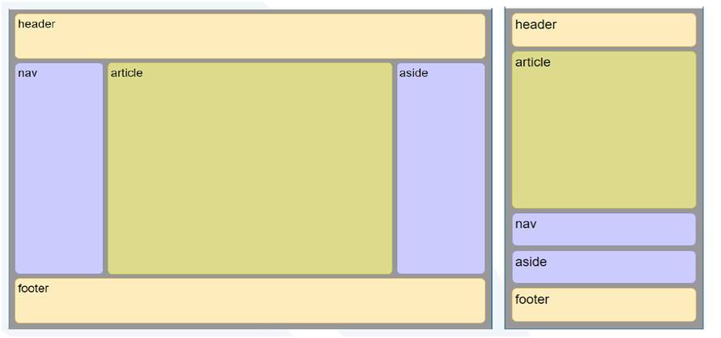
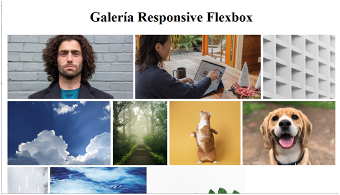

# Práctica 4.5 CSS Flexbox 

## Parte 1

Crea un diseño mediante Flexbox para conseguir que una página con 3 columnas que se adapte con el estilo lo más similar posible a la captura (se adjunta código HTML). Permitir el cambio adaptativo a una sola columna para dispositivos de menos de **640px**. 

## Parte 2

Crea una web que contenga una **galería** con al menos 6 imágenes y el código CSS necesario que permita adaptarse al menos a 3 dispositivos y que utilice varias de las propiedades flexbox vistas en clase (align, justify, order, etc.)  

- Pantalla panorámica  
- Escritorio  
- Tableta  
- Móvil  
 

